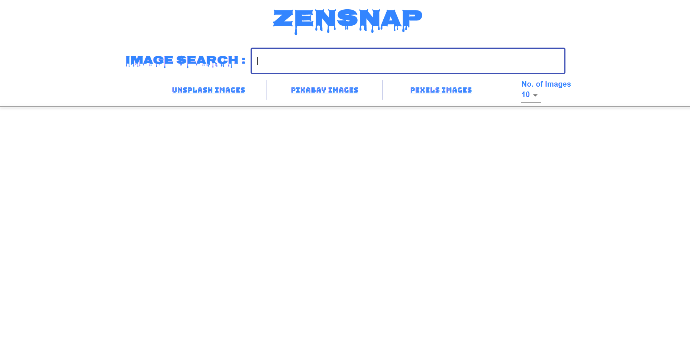
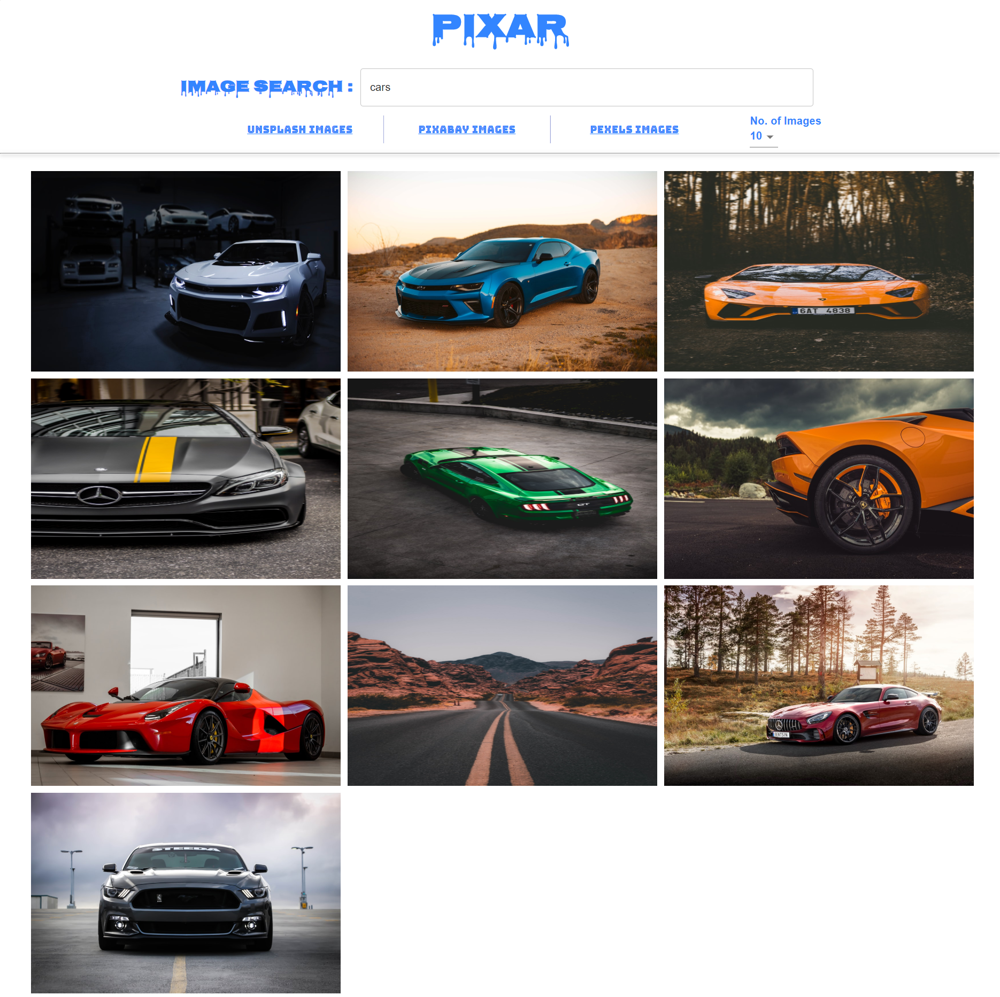
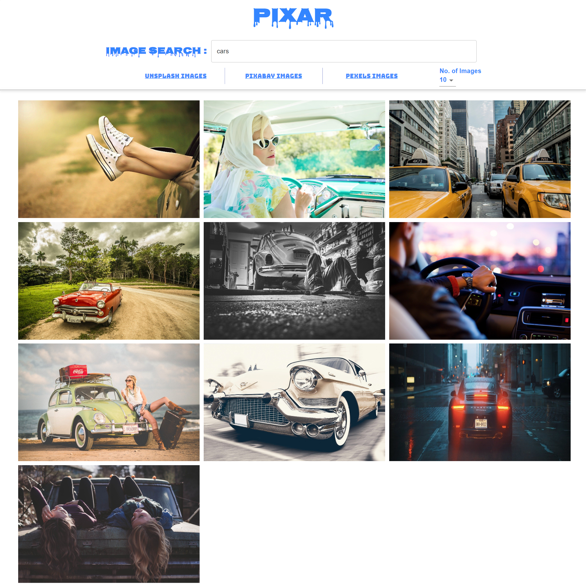
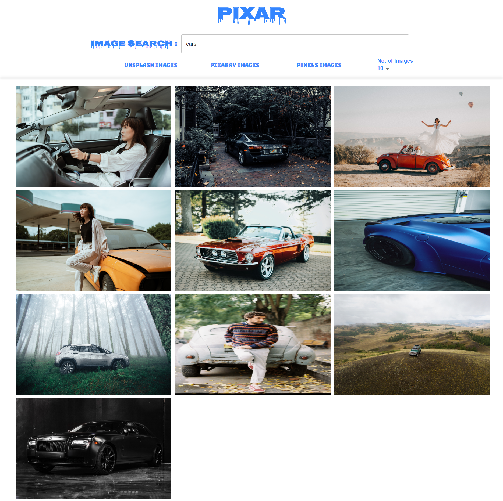

# ZenSnap

ZenSnap is an image search system that retrieves a gallery of images depending upon the search query and depth limit using ReactJS library. The search query is sent through HTTP to three different image querying APIs namely: Unsplash, PixaBay and Pexels. The response is a JSON object containing a list of image URLs that satisfy the search query. HTTP request and response interactions are handled using Axios library on NodeJs platform Navigation to different tabs is done through React-Router to obtain Single Page Application.

## Features

**1. Search functionality added to search photos and fetch data from different API's using Axios Javascript Library.**

**2. No. of Images per page is dynamically decided by the User.**

**3. Image magnification feature is implemented through react-medium-zoom library for individual images.**

## Built With

- React js
- React Router
- Axios
- Unsplash API
- PixaBay API
- Pexels API
- Material-UI

## Getting Started

Clone/download the repository on your local machine.
Create a .env file in the root of the project folder and insert your secret keys. See the example below.

`REACT_APP_UNSPLASH_API_KEY='Your Unsplash API KEY'`  
`REACT_APP_PIXABAY_API_KEY='Your PixaBay API KEY'`  
`REACT_APP_PEXELS_API_KEY='Your Pexels API KEY'`

##### Install dependencies

`npm install`

##### Run ZenSnap from the root directory.

`npm start`

## ScreenShots

### Main Page

### Unsplash API Page

### PixaBay API Page

### Pexels API Page

